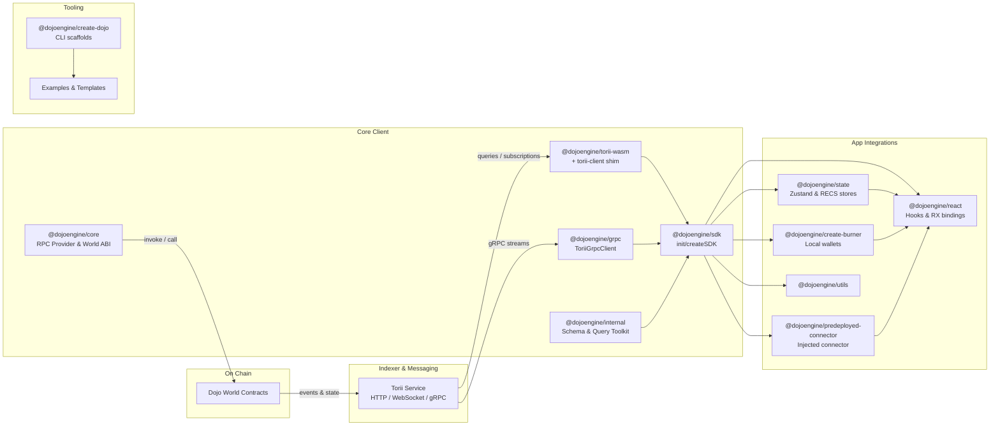

# Dojo.js Architecture Overview

## High-Level Components

Dojo.js is organized as a set of focused packages that cooperate to index, query, and interact with Dojo worlds on Starknet.

- **@dojoengine/sdk** orchestrates Torii clients, message signing flows, and schema-aware queries for both web and node runtimes.
- **@dojoengine/core** exposes the `DojoProvider`, a thin Starknet RPC wrapper that performs direct world contract reads and invokes.
- **@dojoengine/grpc** supplies a rich gRPC client with streaming subscriptions and data mappers for Torii indexer interactions.
- **@dojoengine/internal** concentrates shared schema utilities, query builders, pagination helpers, and token tooling used by the SDK.
- **@dojoengine/state** and **@dojoengine/react** provide state management and UI bindings, enabling entity streaming and optimistic updates in applications.
- **Tooling packages** such as `@dojoengine/create-burner`, `@dojoengine/predeployed-connector`, and `@dojoengine/create-dojo` enhance developer experience with wallet utilities and project scaffolding.

## Runtime Flow

## Key Responsibilities

1. Torii indexes on-chain world events and exposes them via WASM bindings and gRPC streams for consumption by the SDK.
2. The SDK coordinates Torii clients, message signing, and schema-driven parsing to provide a cohesive developer surface.
3. `DojoProvider` gives direct Starknet RPC access when applications need to call world contracts outside the indexer path.
4. Application layers like React hooks and Zustand stores sit on top of the SDK to deliver real-time entity state to UIs.
5. Wallet tooling and scaffolding packages round out the developer workflow for building and testing Dojo-powered apps.
