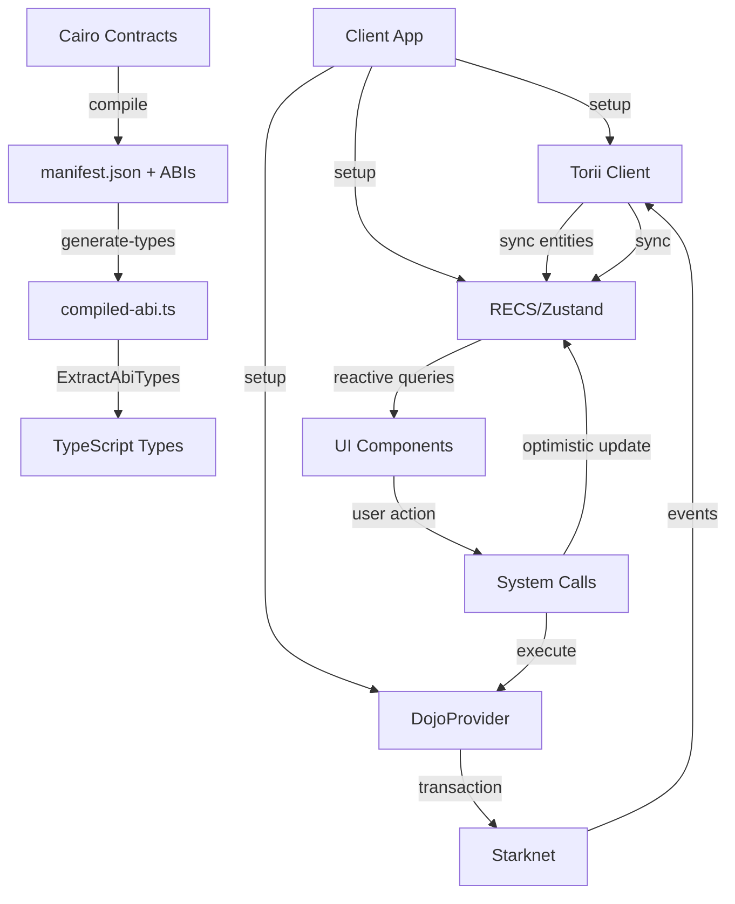

# Dojo Client App Example

This example demonstrates the complete flow of a Dojo client application, showcasing how to build type-safe, reactive applications using the Dojo engine.

## Architecture Overview

```
example/
├── core/                    # Shared Dojo logic (framework-agnostic)
│   ├── dojo/
│   │   ├── generated/      # Auto-generated setup files
│   │   ├── config.ts       # Dojo configuration
│   │   └── createSystemCalls.ts  # System calls with optimistic updates
│   └── types.ts            # ABI-derived type system
└── frameworks/             # Framework-specific implementations
    ├── react/
    ├── svelte/
    ├── vue/
    ├── node/
    └── worker/
```

## The New Type System

Dojo.js provides a powerful type system that extracts TypeScript types directly from your compiled Cairo contracts (based on the dojo manifest)

```typescript
// This command will extract all required types from your manifest and extract them into a ts file that is a representation of your json manifest.
bunx @dojoengine/core --manifest-path ../contracts/manifest_dev.json --output ./compiled.json --generate-types
```

### Type Extraction

```typescript
import {
  ExtractAbiTypes,
  ModelsFromAbi,
  GetModel,
  GetActionFunction,
} from "@dojoengine/core";
// This import the file that you should have generated in the step above.
import { compiledAbi } from "./compiled";

// Extract all types from the ABI
export type DojoStarterAbi = ExtractAbiTypes<typeof compiledAbi>;

// Get the models schema organized by namespace
export type DojoStarterSchema = ModelsFromAbi<typeof compiledAbi>;
```

### Accessing Models

You can access models in two ways:

```typescript
// Option 1: Direct schema access
export type Vec2 = DojoStarterSchema["dojo_starter"]["Vec2"];
export type Pos = DojoStarterSchema["dojo_starter"]["Position"];

// Option 2: Using GetModel utility
export type Position = GetModel<typeof compiledAbi, "dojo_starter-Position">;
export type Moves = GetModel<typeof compiledAbi, "dojo_starter-Moves">;
```

### Working with Enums

Cairo enums are represented as `CairoCustomEnum` in TypeScript:

```typescript
// Extract the enum type
export type DirectionEnum =
  DojoStarterAbi["enums"]["dojo_starter::models::Direction"];
export type Direction = DirectionEnum["type"];
export type DirectionVariant = DirectionEnum["variantNames"];

// Create runtime helpers for easier usage
export const DirectionValue = {
  None: () => new CairoCustomEnum({ None: "()" }),
  Left: () => new CairoCustomEnum({ Left: "()" }),
  Right: () => new CairoCustomEnum({ Right: "()" }),
  Up: () => new CairoCustomEnum({ Up: "()" }),
  Down: () => new CairoCustomEnum({ Down: "()" }),
} as const;
```

### Type-Safe Actions

Extract action function signatures for compile-time safety:

```typescript
// Get you whole system type
export type DojoStarterActions =
  DojoStarterAbi["interfaces"]["dojo_starter::systems::actions::IActions"];

// Or single action
export type SpawnAction = GetActionFunction<
  typeof compiledAbi,
  "dojo_starter",
  "IActions",
  "spawn"
>;
export type MoveAction = GetActionFunction<
  typeof compiledAbi,
  "dojo_starter",
  "IActions",
  "move"
>;
```

### Getting a system bound Provider

Dojo.js exposes a provider that you can use to automatically bind your dojo contracts to.

```typescript
import { DojoProvider } from "@dojoengine/core";

const provider = new DojoProvider<DojoStarterActions>();

// you can now call your contracts.
provider.spawn(account);
provider.move(account, { direction: DirectionValue.Right() });
```

## Setup Flow

The setup process initializes all necessary components for your Dojo app:

```typescript
export async function setup({ ...config }: DojoConfig) {
  // 1. Initialize Torii client for real-time data syncing
  const toriiClient = new torii.ToriiClient({
    toriiUrl: config.toriiUrl,
    worldAddress: config.manifest.world.address || "",
  });

  // 2. Setup RECS component system
  const contractComponents = defineContractComponents(world);
  const clientComponents = createClientComponents({ contractComponents });

  // 3. Sync entities from Torii
  const sync = await getSyncEntities(
    toriiClient,
    contractComponents as any,
    KeysClause([], [undefined], "VariableLen").build(),
    [],
  );

  // 4. Setup contract interaction layer
  const dojoProvider = new DojoProvider(config.manifest, config.rpcUrl);
  const client = await setupWorld(dojoProvider);

  // 5. Setup burner accounts for development
  const burnerManager = new BurnerManager({
    masterAccount: new Account(
      dojoProvider.provider,
      config.masterAddress,
      config.masterPrivateKey,
    ),
    accountClassHash: config.accountClassHash,
    rpcProvider: dojoProvider.provider,
  });

  // 6. Create system calls with optimistic updates
  const systemCalls = createSystemCalls(
    { client },
    contractComponents,
    clientComponents,
  );

  return {
    client,
    clientComponents,
    contractComponents,
    systemCalls,
    dojoProvider,
    burnerManager,
    toriiClient,
    sync,
    config,
  };
}
```

## Data Fetching through Torii

Torii is a real-time indexer that syncs your Dojo world state to the client. You can choose between different state management solutions.

### Option 1: SDK with Zustand Store (Recommended)

The Dojo SDK provides a built-in Zustand store with type-safe hooks and automatic optimistic updates.

#### Create Your Typed Store

```typescript
import { createDojoStore } from "@dojoengine/sdk/state";
import type { DojoStarterSchema } from "./types";

// Create a typed Zustand store based on your schema
export const useDojoStore = createDojoStore<DojoStarterSchema>();
```

#### Initialize with Torii Sync

```typescript
import { init } from "@dojoengine/sdk";

const sdk = await init<DojoStarterSchema>(
  {
    client: {
      rpcUrl: "http://localhost:5050",
      toriiUrl: "http://localhost:8080",
      worldAddress: "0x...",
    },
    domain: {
      name: "Example",
      version: "1.0",
      chainId: "0x...",
      revision: "1",
    },
  },
  dojoConfig.manifest,
);

// SDK automatically syncs entities to the Zustand store
await sdk.subscribeEntityQuery(
  new ToriiQueryBuilder()
    .withClause(
      KeysClause(
        // models to apply clause to
        [],
        // keys of your dojo models (here undefined act as a placeholder that matches everything)
        [undefined],
        // matches entities that has at least one key
        "VariableLen",
      ).build(),
    )
    .build(),
);
```

#### Query Data in React

The SDK provides type-safe React hooks:

```typescript
import { useModel, useModels } from "@dojoengine/sdk/react";

function GameComponent({ accountAddress }: { accountAddress: string }) {
  // Get a specific model for an entity
  const position = useModel(accountAddress, "dojo_starter-Position");
  const moves = useModel(accountAddress, "dojo_starter-Moves");

  // Get all entities with a specific model
  const allPositions = useModels("dojo_starter-Position");

  return (
    <div>
      <p>Position: {position?.vec.x}, {position?.vec.y}</p>
      <p>Moves remaining: {moves?.remaining}</p>
      <p>Total players: {Object.keys(allPositions).length}</p>
    </div>
  );
}
```

#### Optimistic Updates

The Zustand store has built-in support for optimistic updates:

```typescript
import { useDojoStore } from "./store";

async function moveWithOptimisticUpdate(
  account: Account,
  direction: Direction,
) {
  const store = useDojoStore.getState();
  const transactionId = crypto.randomUUID();

  // Apply optimistic update
  store.applyOptimisticUpdate(transactionId, (draft) => {
    const entity = draft.entities[account.address];
    if (entity?.models?.dojo_starter?.Position) {
      const position = entity.models.dojo_starter.Position;
      switch (direction.activeVariant()) {
        case "Up":
          position.vec.y--;
          break;
        case "Down":
          position.vec.y++;
          break;
        case "Left":
          position.vec.x--;
          break;
        case "Right":
          position.vec.x++;
          break;
      }
    }
  });

  try {
    // Execute contract call
    await provider.move(account, { direction });
    // Confirm transaction (Torii will sync the real state)
    store.confirmTransaction(transactionId);
  } catch (error) {
    // Revert optimistic update on error
    store.revertOptimisticUpdate(transactionId);
    throw error;
  }
}
```

#### Vanilla Zustand Store (Non-React)

For Node.js or other environments:

```typescript
import { createDojoStore } from "@dojoengine/sdk/state";
import type { DojoStarterSchema } from "./types";

const store = createDojoStore<DojoStarterSchema>();

// Subscribe to entity changes
const unsubscribe = store
  .getState()
  .subscribeToEntity(accountAddress, (entity) => {
    console.log("Entity updated:", entity);
  });

// Get entity data
const position = store.getState().getEntity(accountAddress)?.models
  ?.dojo_starter?.Position;
```

### Option 2: RECS (Entity Component System)

RECS provides a reactive entity component system perfect for games and real-time applications. Use this if you need fine-grained control over rendering optimizations or building game engines.

#### Define Contract Components

Components mirror your Cairo models:

```typescript
export function defineContractComponents(world: World) {
  return {
    Position: defineComponent(
      world,
      {
        player: RecsType.BigInt,
        vec: { x: RecsType.Number, y: RecsType.Number },
      },
      {
        metadata: {
          name: "dojo_starter-Position",
          types: ["contractaddress", "u32", "u32"],
          customTypes: ["Vec2"],
        },
      },
    ),
    Moves: defineComponent(
      world,
      {
        player: RecsType.BigInt,
        remaining: RecsType.Number,
        last_direction: RecsType.Number,
        can_move: RecsType.Boolean,
      },
      {
        metadata: {
          name: "dojo_starter-Moves",
          types: ["contractaddress", "u8", "enum", "bool"],
          customTypes: ["Direction"],
        },
      },
    ),
  };
}
```

#### Create Client Components with Optimistic Updates

```typescript
export function createClientComponents({
  contractComponents,
}: {
  contractComponents: ContractComponents;
}) {
  return {
    ...contractComponents,
    Position: overridableComponent(contractComponents.Position),
    Moves: overridableComponent(contractComponents.Moves),
  };
}
```

#### Query Data in React

```typescript
import { useComponentValue } from "@dojoengine/react";

function GameComponent() {
  const {
    clientComponents: { Position, Moves },
  } = useDojo();

  // Get entity ID for the current account
  const entityId = getEntityIdFromKeys([BigInt(account.address)]) as Entity;

  // Reactively get component values
  const position = useComponentValue(Position, entityId);
  const moves = useComponentValue(Moves, entityId);

  return (
    <div>
      <p>Position: {position?.vec.x}, {position?.vec.y}</p>
      <p>Moves remaining: {moves?.remaining}</p>
    </div>
  );
}
```

## Contract Calls via DojoProvider

DojoProvider handles all contract interactions with type safety and proper error handling.

### Setup System Actions

Bind your system actions to the provider:

```typescript
export const setupWorld = async (provider: DojoProvider): Promise<IWorld> => {
  const actions = () => ({
    spawn: async ({ account }: { account: AccountInterface }) => {
      try {
        return await provider.execute(
          account,
          {
            contractName: "actions",
            entrypoint: "spawn",
            calldata: [],
          },
          "dojo_starter",
        );
      } catch (error) {
        console.error(`Error executing spawn:`, error);
        throw error;
      }
    },

    move: async ({
      account,
      direction,
    }: {
      account: AccountInterface;
      direction: Direction;
    }) => {
      try {
        return await provider.execute(
          account,
          {
            contractName: "actions",
            entrypoint: "move",
            calldata: [direction],
          },
          "dojo_starter",
        );
      } catch (error) {
        console.error(`Error executing move:`, error);
        throw error;
      }
    },
  });

  return { actions: actions() };
};
```

### System Calls with Optimistic Updates

Create a higher-level API that provides optimistic updates for better UX:

```typescript
export function createSystemCalls(
  { client }: { client: IWorld },
  contractComponents: ContractComponents,
  { Position, Moves }: ClientComponents,
) {
  const spawn = async (account: AccountInterface) => {
    const entityId = getEntityIdFromKeys([BigInt(account.address)]) as Entity;

    // Optimistic update - show immediately
    const positionId = uuid();
    Position.addOverride(positionId, {
      entity: entityId,
      value: { player: BigInt(entityId), vec: { x: 10, y: 10 } },
    });

    const movesId = uuid();
    Moves.addOverride(movesId, {
      entity: entityId,
      value: {
        player: BigInt(entityId),
        remaining: 100,
        last_direction: 0,
      },
    });

    try {
      // Execute actual contract call
      const { transaction_hash } = await client.actions.spawn({
        account,
      });

      // Wait for transaction and sync events
      setComponentsFromEvents(
        contractComponents,
        getEvents(
          await account.waitForTransaction(transaction_hash, {
            retryInterval: 100,
          }),
        ),
      );
    } catch (error) {
      console.error(error);
      // Rollback optimistic updates on error
      Position.removeOverride(positionId);
      Moves.removeOverride(movesId);
    } finally {
      // Remove optimistic updates (real data from Torii takes over)
      Position.removeOverride(positionId);
      Moves.removeOverride(movesId);
    }
  };

  const move = async (account: AccountInterface, direction: Direction) => {
    const entityId = getEntityIdFromKeys([BigInt(account.address)]) as Entity;

    // Optimistic position update
    const positionId = uuid();
    Position.addOverride(positionId, {
      entity: entityId,
      value: {
        player: BigInt(entityId),
        vec: updatePositionWithDirection(
          direction,
          getComponentValue(Position, entityId) as any,
        ).vec,
      },
    });

    try {
      const { transaction_hash } = await client.actions.move({
        account,
        direction,
      });

      setComponentsFromEvents(
        contractComponents,
        getEvents(
          await account.waitForTransaction(transaction_hash, {
            retryInterval: 100,
          }),
        ),
      );
    } catch (error) {
      console.error(error);
      Position.removeOverride(positionId);
    } finally {
      Position.removeOverride(positionId);
    }
  };

  return { spawn, move };
}
```

## Complete Data Flow



## Framework Integration Example (React)

### 1. Create Dojo Context

```typescript
import { createContext, ReactNode, useContext } from "react";
import { SetupResult } from "@showcase/dojo";
import { useBurnerManager } from "@dojoengine/create-burner";

const DojoContext = createContext<DojoContextValue | null>(null);

export const DojoProvider = ({
    children,
    value,
}: {
    children: ReactNode;
    value: SetupResult;
}) => {
    const { burnerManager } = value;
    const burner = useBurnerManager({ burnerManager });

    return (
        <DojoContext.Provider
            value={{
                ...value,
                account: burner,
            }}
        >
            {children}
        </DojoContext.Provider>
    );
};

export const useDojo = () => {
    const context = useContext(DojoContext);
    if (!context) {
        throw new Error("useDojo must be used within a DojoProvider");
    }
    return context;
};
```

### 2. Initialize in App

```typescript
import { setup, dojoConfig } from "@showcase/dojo";
import { DojoProvider } from "./dojo/DojoContext";

function App() {
    const [setupResult, setSetupResult] = useState<SetupResult | null>(null);

    useEffect(() => {
        setup(dojoConfig).then(setSetupResult);
    }, []);

    if (!setupResult) return <div>Loading...</div>;

    return (
        <DojoProvider value={setupResult}>
            <Game />
        </DojoProvider>
    );
}
```

### 3. Use in Components

```typescript
import { useDojo } from "./dojo/useDojo";
import { DirectionValue } from "@showcase/dojo";

function Game() {
    const {
        setup: {
            systemCalls: { spawn, move },
            clientComponents: { Position, Moves },
        },
        account,
    } = useDojo();

    const entityId = getEntityIdFromKeys([
        BigInt(account.account.address)
    ]) as Entity;

    const position = useComponentValue(Position, entityId);
    const moves = useComponentValue(Moves, entityId);

    return (
        <div>
            <button onClick={() => spawn(account.account)}>
                Spawn
            </button>

            <div>Position: {position?.vec.x}, {position?.vec.y}</div>
            <div>Moves: {moves?.remaining}</div>

            <button onClick={() => move(account.account, DirectionValue.Up())}>
                Move Up
            </button>
            <button onClick={() => move(account.account, DirectionValue.Down())}>
                Move Down
            </button>
            <button onClick={() => move(account.account, DirectionValue.Left())}>
                Move Left
            </button>
            <button onClick={() => move(account.account, DirectionValue.Right())}>
                Move Right
            </button>
        </div>
    );
}
```

## Getting Started

### Prerequisites

1. Dojo installed and running (Katana + Torii)
2. World contracts deployed
3. `manifest_dev.json` generated in `worlds/dojo-starter/`

### Generate Types

```bash
npx @dojoengine/core compile-abi \
  --manifest worlds/dojo-starter/manifest_dev.json \
  --output worlds/dojo-starter/compiled-abi.json \
  --generate-types
```

### Run Examples

```bash
# Install dependencies
pnpm install

# Run specific framework
bun run dev:react
bun run dev:svelte
bun run dev:vue
bun run dev:node
bun run dev:worker
```

## Key Concepts

### Torii Client

Real-time indexer that syncs Dojo world state to the client. Subscribes to entity updates and provides query-based data fetching.

### RECS (Reactive Entity Component System)

A reactive state management system where:

- **Entities** are unique IDs (e.g., player addresses)
- **Components** are data structures (e.g., Position, Moves)
- **Queries** reactively track component values

### Optimistic Updates

UI updates immediately before the transaction confirms, then:

- If successful: Torii syncs the real state
- If failed: Optimistic update is rolled back

### Type Safety

End-to-end type safety from Cairo contracts to TypeScript:

1. Cairo contracts → compiled ABI
2. ABI → TypeScript types via `ExtractAbiTypes`
3. Types → IDE autocomplete + compile-time checks

### DojoProvider

Contract interaction layer that:

- Reads contract addresses from manifest
- Provides typed execute functions
- Handles transaction formatting and submission

## Additional Resources

- [Dojo Book](https://book.dojoengine.org/)
- [Dojo.js SDK Documentation](/packages/sdk/readme.md)
- [Type System Documentation](/packages/core/src/types/)
