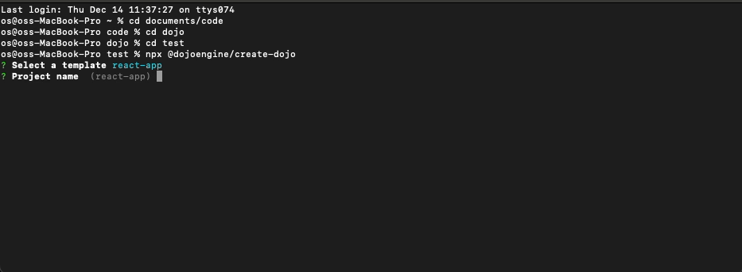

<!-- markdownlint-disable -->
<div align="center">
  
</div>
<div align="center">
<br />
<!-- markdownlint-restore -->

<a href="https://twitter.com/dojostarknet">

</a>
<a href="https://github.com/dojoengine/dojo">

</a>

[](https://discord.gg/PwDa2mKhR4)
![Github Actions][gha-badge] [![Telegram Chat][tg-badge]][tg-url]

[gha-badge]: https://img.shields.io/github/actions/workflow/status/dojoengine/dojo/ci.yml?branch=main
[tg-badge]: https://img.shields.io/endpoint?color=neon&logo=telegram&label=chat&style=flat-square&url=https%3A%2F%2Ftg.sumanjay.workers.dev%2Fdojoengine
[tg-url]: https://t.me/dojoengine

</div>

# Dojo: The Provable Game Engine

**Dojo is a community driven open-source, Provable Game Engine, providing a comprehensive toolkit for building verifiable games and autonomous worlds.**

You can get started by simply bootstrapping dojo world like so. You will need [dojo](https://github.com/dojoengine/dojo) installed.

```console
npx @dojoengine/create-dojo
```

[](./media/dojo-init.mov)

### Contributing to dojo.js

Dojo.js is MIT licensed and welcomes contributors. Setting up your environment is simple.

#### Prerequisites

1. **Bun Installation**: We use [bun](https://bun.sh/) in this repository. To install it, run:
    ```console
    curl -fsSL https://bun.sh/install | bash
    ```

From the repository root, run the following to install all the necessary package dependencies:

```console
bun install
```

#### Package Linking:

To link the packages to the examples or your own project, from the root directory, run:

```console
bun link
```

#### Building Packages:

**Note**: Before running the examples, you must build each package.

To do so, navigate to a specific package directory and run the command below. This will initiate bun in watch mode, which will automatically compile and update based on local changes:

```console
bun run build --watch
```

To build all packages, from the root directory, run:

```console
bun run build
```

To watch for changes on all packages in parallel, from the root directory, run:

```console
bun run build-watch
```

#### Dojo starter:

To install dojo-starter submodule, run:

```console
git submodule update --init --recursive
```

---

### Examples

If you have issues on WSL, install package first then run command :

```console
npm i @dojoengine/create-dojo -g
npx @dojoengine/create-dojo
```

To run the examples that have the linked packages, follow the steps below:

**Terminal 1**: Set up the dojo starter with specific configurations.

```console
cd examples/dojo-starter
katana --disable-fee --block-time 1000
```

**Terminal 2**: Build and migrate the dojo starter.

```console
cd examples/dojo-starter
sozo build
sozo migrate
```

**Terminal 3**: Start the React app.

```console
cd examples/<package>
bun install
bun dev
```
